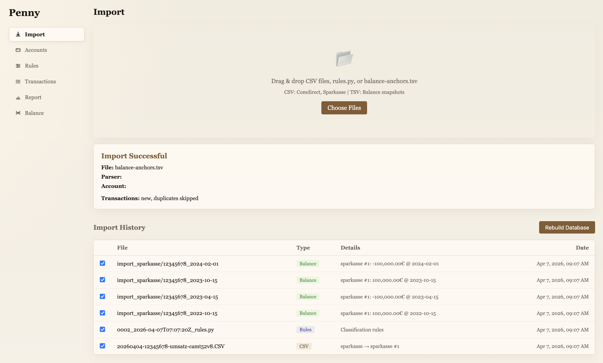
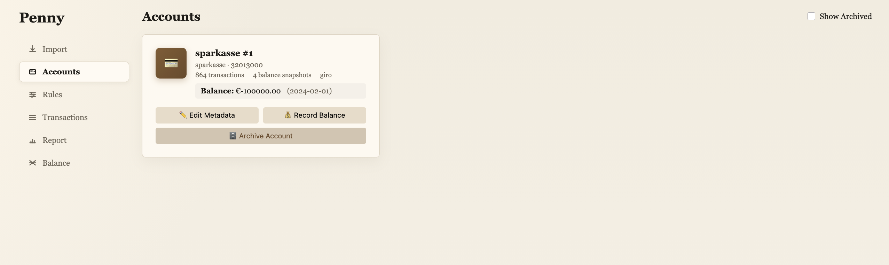
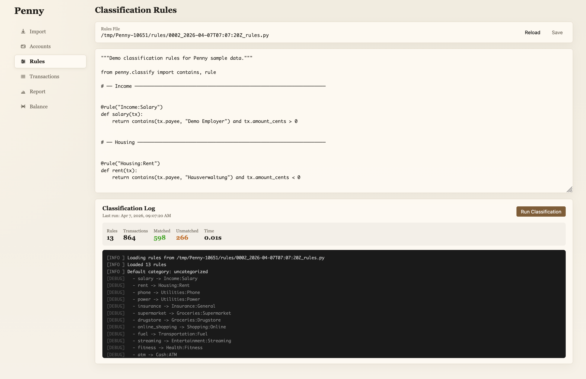
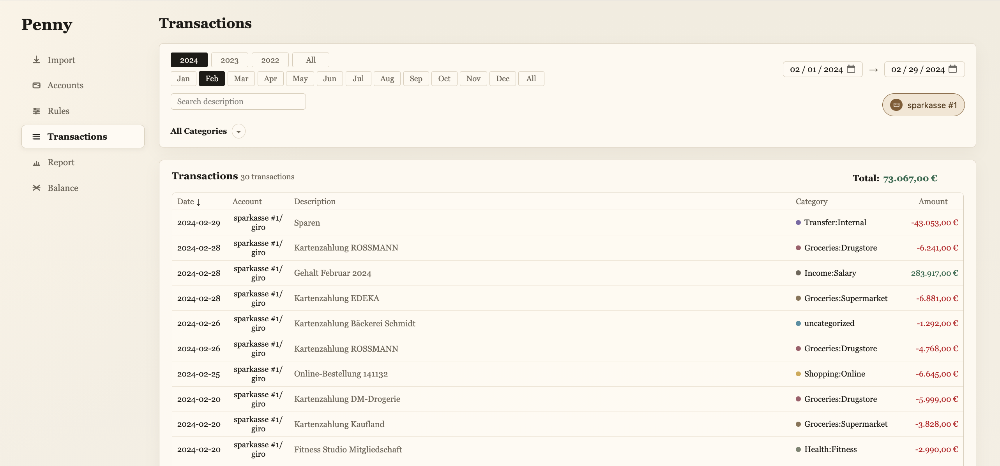
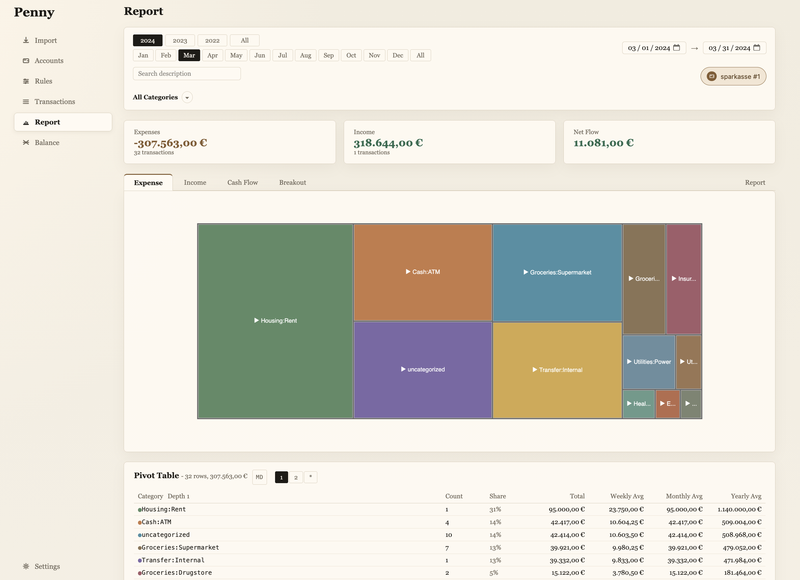
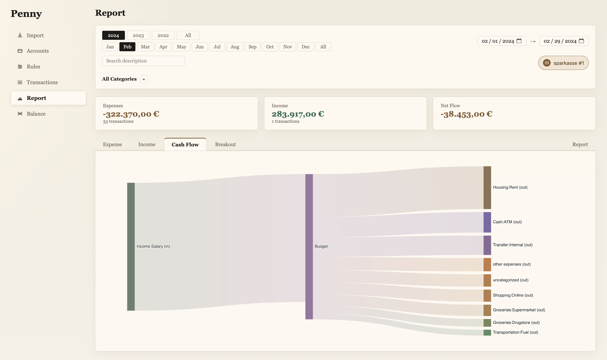
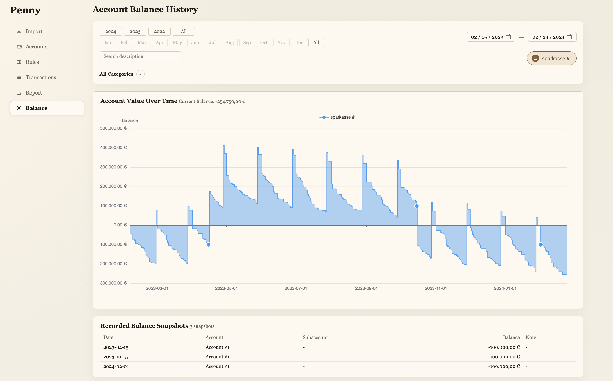

# Penny

Penny is a local-first personal finance tool built on original bank records.

Drop your bank's CSV exports unchanged, and Penny preserves them, parses them, normalizes them, and builds trustworthy reports on top. The CLI enables LLM-assisted co-creation of classification rules.

## Features

- **Privacy-first** - All data stays local, no cloud sync, no credential sharing
- **Artifact-first import** - Drop original CSV exports unchanged; Penny archives and parses them
- **Rebuildable state** - Database can be rebuilt from archived imports at any time
- **Multi-account consolidation** - All accounts in one view, across banks, over years
- **Automatic deduplication** - Safe handling of overlapping imports
- **Transfer linking** - Link matching debits/credits into transfer groups
- **Balance anchors** - Record known balance points for reconciliation
- **Python classification rules** - Categorize transactions with ordered rules, co-created with LLM assistance

Supported banks: Comdirect, Sparkasse.

## Install

### macOS Desktop App

Download the latest DMG from [GitHub Releases](https://github.com/HeinrichHartmann/Penny/releases).

### CLI

The CLI shares state with the desktop app and enables LLM-assisted workflows.

```bash
# Install from GitHub
uv tool install git+https://github.com/HeinrichHartmann/Penny.git

# Or install a specific version
uv tool install git+https://github.com/HeinrichHartmann/Penny.git@v0.3.0
```

## UI

The desktop app provides these views:

| View | Description |
|------|-------------|
| **Import** | Drag-and-drop interface for original bank records (CSV exports, rules.py, balance anchors). Shows import history with file types and timestamps. Supports database rebuild from archived imports. |
| **Accounts** | Overview of all accounts with metadata, transaction counts, balance snapshots, and current balance. Manage account settings, record manual balance anchors, or archive accounts. |
| **Rules** | View and edit classification rules (Python). Run classification and see match statistics. Rules can be co-created with LLM assistance via the CLI. |
| **Transactions** | Filterable list of all transactions with year/month navigation, date range selection, search, and category filtering. Shows date, account, description, assigned category, and amount. |
| **Report** | Multi-view financial analysis: **Expense** shows a treemap of spending by category with a pivot table breakdown. **Income** summarizes income sources. **Cash Flow** displays a Sankey diagram of money flowing between categories. **Breakout** provides detailed category analysis. |
| **Balance** | Account balance history chart over time. Shows recorded balance snapshots (anchors) that serve as ground-truth reference points for balance reconstruction. |

### Gallery

<p align="center">
  
  
</p>
<p align="center">
  
  
</p>
<p align="center">
  
  
</p>
<p align="center">
  
</p>

## CLI Reference

### Import & Archive

```bash
# Import a bank CSV (parser auto-detected or explicit)
penny import ~/Downloads/umsaetze.csv
penny import ~/Downloads/export.csv --csv-type sparkasse

# Apply classification rules
penny apply rules.py -v

# Import rules into the vault
penny import-rules rules.py
```

### Viewing Data

```bash
# List accounts
penny accounts list

# List recent transactions
penny transactions list --limit 20
penny transactions list --from 2024-01-01 --to 2024-03-31
penny transactions list --category "food" --account 1
penny transactions list -q "REWE"

# Pivot table by category
penny pivot --from 2024-01-01 --to 2024-12-31 -d 2
penny pivot --tab income
```

### Reports

```bash
# Comprehensive financial report
penny report 2024              # Full year
penny report 2024-03           # Single month
penny report 2024 -a Shared    # Filter by account
```

### Vault & Database

```bash
# Check vault status
penny vault status

# Rebuild database from archived imports
penny db rebuild

# View import history
penny log list
```

### Server

```bash
# Start the web server (used by desktop app)
penny serve
```

## Status

Current focus:
- Trustworthy ingestion of official bank artifacts
- Reproducible imports with full archive
- Rule-based categorization via Python
- Transfer group linking
- Iterative LLM-assisted workflows

See [DEVELOPMENT.md](DEVELOPMENT.md) for build and contribution instructions.
